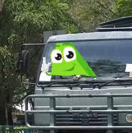

# transport-helper-bot


Tracy the Transport Triangle (TTT) is a Telegram bot built to assist administrative tasks in the Singapore Armed Forces (SAF) Transport formation.

You can try out the development version of the bot [here](https://t.me/TracyTheTriangleDevBot). 

Tracy the Transport Triangle runs on [grammY](https://grammy.dev/), and is deployed using [railway](railway.app/). She stores her data on AWS, through this [Serverless application](https://github.com/khayliang/transport-helper-server).

## Background
As a transport operator a.k.a driver, one will get a civilian license if they drive a distance of 4000km. Next, in the SAF, vehicle movement must also be tracked for administrative purposes. 

However, recording all of this data is done through a cumbersome hodgepodge of paper records and chain messages over WhatsApp, and time is wasted searching through records for information because everything is all over the place.

Hence, Tracy the Transport Triangle aims to incorporate all current record keeping activity on the cloud, and provide intuitive access to the data.

## Installation
```
npm i
```
Add environment variables in a `.env` file. The currently used variables are:
```
# Telegram bot token
TOKEN_DEV
# Backend API
API_URL_DEV
```
## Usage
```
npm start
```
